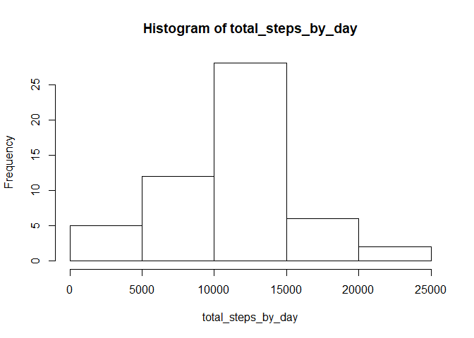
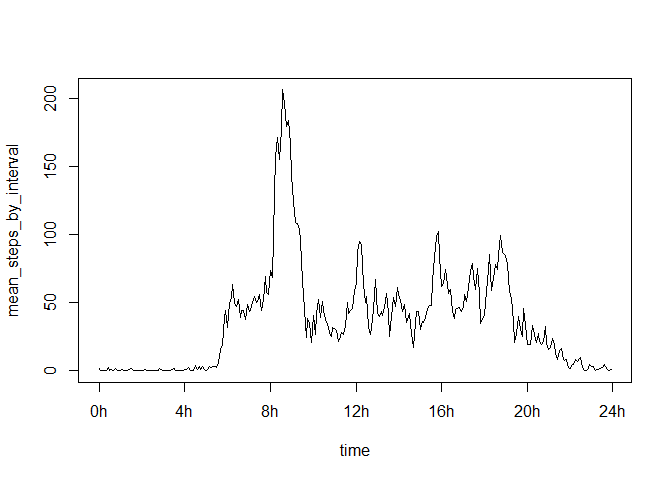
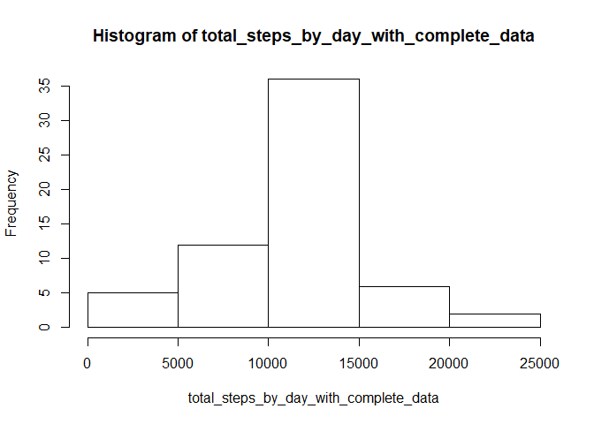
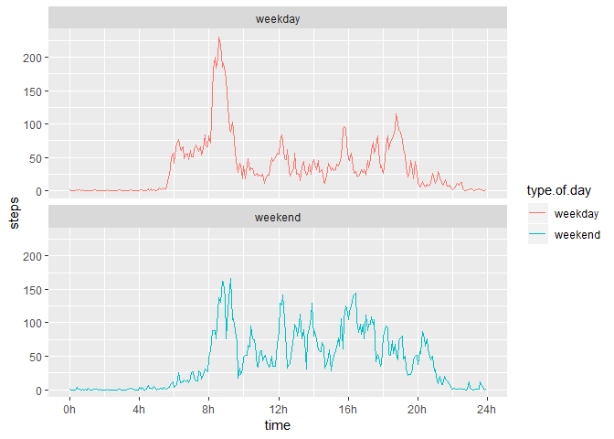

## Loading and preprocessing the data

1. Loading the data :


```r
data <- read.csv(file="data/activity.csv", na.strings  = "NA", stringsAsFactors = FALSE)
str(data)
```

```
## 'data.frame':	17568 obs. of  3 variables:
##  $ steps   : int  NA NA NA NA NA NA NA NA NA NA ...
##  $ date    : chr  "2012-10-01" "2012-10-01" "2012-10-01" "2012-10-01" ...
##  $ interval: int  0 5 10 15 20 25 30 35 40 45 ...
```

2. Preprocessing the data :


```r
# convert from character format to date format
data$date <- as.Date(data$date)
```

## What is mean total number of steps taken per day?

1. Calculate the total number of steps taken per day


```r
total_steps_by_day <- with(data, tapply(steps,date,sum))
head(total_steps_by_day)
```

```
## 2012-10-01 2012-10-02 2012-10-03 2012-10-04 2012-10-05 2012-10-06 
##         NA        126      11352      12116      13294      15420
```

2. Plot the histogram


```r
hist(total_steps_by_day)
```

<!-- -->

3. Calculate the mean and median

```r
summary(total_steps_by_day)
```

```
##    Min. 1st Qu.  Median    Mean 3rd Qu.    Max.    NA's 
##      41    8841   10765   10766   13294   21194       8
```


## What is the average daily activity pattern?

1. Time series plot of the 5-minute interval (x-axis) and the average number of steps taken, averaged across all days (y-axis)


```r
mean_steps_by_interval <- with(data, tapply(steps,interval,mean,na.rm=TRUE))
# CAUTION : "interval" uses a string format ("hhmm") to represent time
# e.g. 105 = 1h05min, 1215 = 12h15min, etc...
# so you can not use interval values as x values for the plot
# if not you will have values at x = ...,50,55,100,105,... 
# instead of x= ...,50,55,60,65,...
interval <- as.numeric(names(mean_steps_by_interval)) 
intervalToTime <- function(interval)
{
    hours <- interval%/%100
    minutes <- interval %%100
    return(60*hours+minutes)
}    
time <- sapply(interval,intervalToTime)
plot(x = time,y=mean_steps_by_interval,type="l",xaxt="n")
axis(side=1, at=c(0,240,480,720,960,1200,1440),
        labels=c("0h","4h","8h","12h","16h","20h","24h"))
```

<!-- -->

2. Which 5-minute interval, on average across all the days in the dataset, contains the maximum number of steps?

```r
indexIntervalWithMax <- which(mean_steps_by_interval==max(mean_steps_by_interval) )
print(paste("Interval with max steps :",interval[indexIntervalWithMax]))
```

```
## [1] "Interval with max steps : 835"
```

## Imputing missing values

1. Calculate and report the total number of missing values in the dataset (i.e. the total number of rows with NA


```r
table(is.na(data))
```

```
## 
## FALSE  TRUE 
## 50400  2304
```

```r
paste("There are", table(is.na(data))[["TRUE"]], "rows with NA values")
```

```
## [1] "There are 2304 rows with NA values"
```

2. Devise a strategy for filling in all of the missing values in the dataset.

```r
# clone the original dataframe
dataComplete <- data[,]
# find NA rows indexes
indexNaRow <- which(is.na(data))
# replace missing value with the average number of steps for the interval
for (i in indexNaRow){
   # find the interval for the missing value
    interval <- data[i,"interval"]
    # find the mean number of steps fo the intervall
    meanValueForInterval <- mean_steps_by_interval[as.character(interval)]
    # replace the mising value by the mean for the interval
    dataComplete[i,"steps"] <- meanValueForInterval
}
```

3. Create a new dataset that is equal to the original dataset but with the missing data filled in.

```r
head(dataComplete)
```

```
##       steps       date interval
## 1 1.7169811 2012-10-01        0
## 2 0.3396226 2012-10-01        5
## 3 0.1320755 2012-10-01       10
## 4 0.1509434 2012-10-01       15
## 5 0.0754717 2012-10-01       20
## 6 2.0943396 2012-10-01       25
```

4. Make a histogram of the total number of steps taken each day and Calculate and report the mean and median total number of steps taken per day. 


```r
total_steps_by_day_with_complete_data <- with(dataComplete, tapply(steps,date,sum))
hist(total_steps_by_day_with_complete_data)
```

<!-- -->

```r
summary(total_steps_by_day_with_complete_data)
```

```
##    Min. 1st Qu.  Median    Mean 3rd Qu.    Max. 
##      41    9819   10766   10766   12811   21194
```


## Are there differences in activity patterns between weekdays and weekends?

1. Create a new factor variable in the dataset with two levels - "weekday" and "weekend" indicating whether a given date is a weekday or weekend day.


```r
days <- weekdays(dataComplete$date)
getTypeOfDay <- function (day){
    if(day == "Saturday"| day == "Sunday"){
        result="weekend"
    } else {
        result="weekday"
    }
    result
}
dataComplete$type.of.day <- as.factor(sapply(days,getTypeOfDay))
```

2. Make a panel plot containing a time series plot of the 5-minute interval (x-axis) and the average number of steps taken, averaged across all weekday days or weekend days (y-axis).


```r
library(dplyr)
library(ggplot2)

stepsByIntervalAndTypeofDay <-  dataComplete %>% 
                                group_by(type.of.day,interval) %>% 
                                summarize(steps=mean(steps))

# CAUTION : "interval" uses a string format ("hhmm") to represent time
# e.g. 105 = 1h05min, 1215 = 12h15min, etc...
# so you can not use interval values as x values for the plot
# if not you will have values at x = ...,50,55,100,105,... 
# instead of x= ...,50,55,60,65,...
# Hence we add a column time (nbr of minutes since 00h00)
stepsByIntervalAndTypeofDay$time <- sapply(stepsByIntervalAndTypeofDay$interval,intervalToTime)

ggplot(data=stepsByIntervalAndTypeofDay, aes(x=time,y=steps) )+
    facet_wrap( ~ type.of.day, ncol = 1,dir="v") +
    geom_line(aes(color=type.of.day))+
    scale_x_continuous(name="time",
                       breaks=c(0,240,480,720,960,1200,1440),
                        labels=c("0h","4h","8h","12h","16h","20h","24h"))
```

<!-- -->
