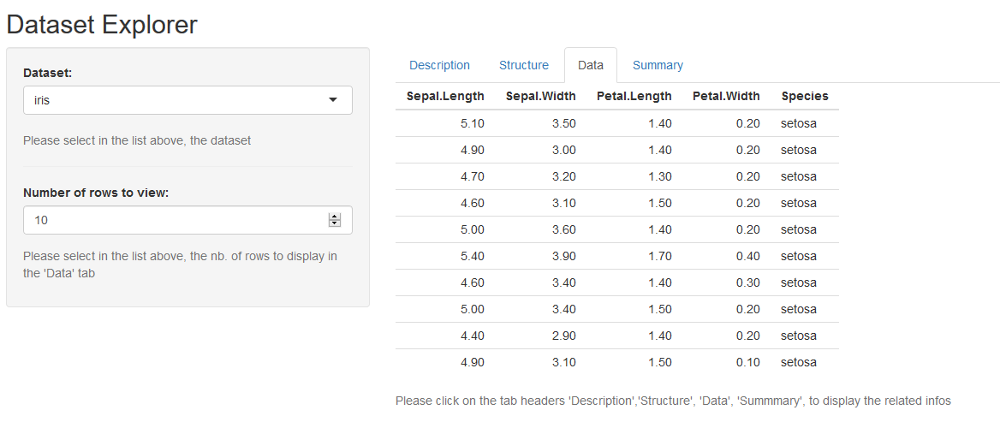

```{r setup, include=FALSE}
knitr::opts_chunk$set(echo = FALSE)
```

## R build-in datasets

Have you ever needed a dataset to test some R code ?
Of course there is a lot of them build-in such as 
the infamous "iris" or "mtcars".
But :

* how to get a comprehensive list of them ?
* for any dataset how to get basic infos (description, structure, data sample, summary) ?

## Dataset Explorer

Here's the answer... A minimalist and simple to use shiny app :




## Under the hood

Thanks to "Dataset Explorer", no need any longer to fumble with
str(), head(), summary() or any other intructions. The app. does it all for you :

```{r cars, echo = TRUE}
summary(cars)
```

## Give it at try... it's free

[https://danpon.shinyapps.io/DatasetExplorer/](https://danpon.shinyapps.io/DatasetExplorer/) 
